<div align="center">


<br/>

[](https://metaventionsai.com)
[](https://github.com/Dicoangelo)
[](http://localhost:8766/dashboard)
[](https://python.org)
[](https://github.com/Dicoangelo/claude-command-center/actions)
[](tests/)

<br/>

*A self-healing, real-time analytics dashboard that monitors every heartbeat of your Claude Code infrastructure.*

<br/>

### Dashboard Preview


<sub>All 15 tabs cycling automatically — Overview through Infrastructure</sub>

</div>


<br/>

<details>
<summary><h3>📸 Tab Gallery — Click to browse all 15 tabs</h3></summary>

<div align="center">

#### 1. Overview


---

#### 2. Memory


---

#### 3. Activity


---

#### 4. Cost


---

#### 5. Projects


---

#### 6. Commands


---

#### 7. Routing


---

#### 8. Co-Evolution


---

#### 9. Context Packs


---

#### 10. Session Outcomes


---

#### 11. Productivity


---

#### 12. Tool Analytics


---

#### 13. Supermemory


---

#### 14. Cognitive


---

#### 15. Infrastructure


</div>
</details>

<br/>

## Live Metrics

<div align="center">

```
┌────────────────────────────────────────────────────────────────────────────────┐
│                                                                                │
│   2,879        258K          89.9K       $5.5K        99.8%       15          │
│   SESSIONS     MESSAGES      TOOL CALLS  API VALUE    CACHE HIT   TABS        │
│                                                                                │
│   ══════════════════════════════════════════════════════════════════════════   │
│                                                                                │
│   • SSE streams every 3 seconds       • Self-heals on failure                 │
│   • SQLite single source of truth     • 8 LaunchAgent daemons                 │
│   • Zero-downtime reloads             • Autonomous watchdog                   │
│                                                                                │
└────────────────────────────────────────────────────────────────────────────────┘
```

</div>

<br/>


<br/>

## System Architecture

```mermaid
%%{init: {'theme': 'dark', 'themeVariables': { 'primaryColor': '#00ff88', 'primaryTextColor': '#fff', 'primaryBorderColor': '#00ff88', 'lineColor': '#00ff88', 'secondaryColor': '#0a1628', 'tertiaryColor': '#0d1117', 'clusterBkg': '#0d1117', 'clusterBorder': '#00ff88'}}}%%
flowchart TB
    subgraph CCC["⚡ CLAUDE COMMAND CENTER ⚡"]
        direction TB

        subgraph PRESENTATION["🖥️ PRESENTATION LAYER"]
            direction LR
            BROWSER["Browser Dashboard\n━━━━━━━━━━\n15 Interactive Tabs\nChart.js Visualizations"]
            SSE["SSE Live Stream\n━━━━━━━━━━\n3s Real-Time Updates\nAuto-Reconnect"]
        end

        subgraph SERVER["🔌 SERVER LAYER"]
            direction LR
            API["API Server\n━━━━━━━━━━\nThreadingHTTPServer\n12 REST Endpoints"]
            STREAMER["DataStreamer\n━━━━━━━━━━\nMD5 Change Detection\nBroadcast to Clients"]
        end

        subgraph INTELLIGENCE["🧠 INTELLIGENCE LAYER"]
            direction LR
            BRAIN["Autonomous Brain\n━━━━━━━━━━\nPattern Detection\nAnomaly Alerts"]
            INTEL["Intelligence Layer\n━━━━━━━━━━\nLeverage Points\nOptimization"]
            HEAL["Self-Heal Engine\n━━━━━━━━━━\n8 Error Patterns\n89% Recovery Rate"]
        end

        subgraph DATA["💾 DATA LAYER"]
            direction LR
            SQLITE[("SQLite\nclaude.db\n━━━━━━━━━━\nSessions • Stats\nRouting • Events")]
            PIPELINE["Data Pipeline\n━━━━━━━━━━\nTranscript Scanner\nToken Aggregator"]
        end
    end

    OPERATOR(("👤 OPERATOR"))

    OPERATOR <==>|"http://localhost:8766"| BROWSER
    BROWSER <-->|"EventSource"| SSE
    SSE <--> API
    API <--> STREAMER
    STREAMER --> SQLITE
    API --> SQLITE
    BRAIN --> SQLITE
    INTEL --> BRAIN
    HEAL -.->|"auto-fix"| PIPELINE
    PIPELINE -->|"sync"| SQLITE
    HEAL -.->|"monitor"| API

    subgraph DAEMONS["🔧 LAUNCHAGENT DAEMONS"]
        WATCHDOG["Watchdog\n━━━━━━━━━━\nAlways-On Guardian"]
        BOOTSTRAP["Bootstrap\n━━━━━━━━━━\nAuto-Start"]
    end

    WATCHDOG -.->|"keepalive"| API
    WATCHDOG -.->|"monitor"| HEAL
    BOOTSTRAP -.->|"init"| DAEMONS

    style CCC fill:#0d1117,stroke:#00ff88,stroke-width:3px
    style PRESENTATION fill:#0a1628,stroke:#00ff88,stroke-width:2px
    style SERVER fill:#0a1628,stroke:#00d9ff,stroke-width:2px
    style INTELLIGENCE fill:#0a1628,stroke:#ff6b6b,stroke-width:2px
    style DATA fill:#0a1628,stroke:#ffd700,stroke-width:2px
    style DAEMONS fill:#0a1628,stroke:#9945ff,stroke-width:2px
    style OPERATOR fill:#00ff88,stroke:#fff,stroke-width:2px,color:#0d1117
```

<div align="center">



<sub>🔄 <i>Self-healing architecture — Every layer monitors the one below it</i></sub>

</div>

<br/>


<br/>

## Dashboard Tabs

<div align="center">
<table>
<tr>
<td width="33%" align="center">

<h3>📊 Overview</h3>
<b>Mission Control</b>
<br/><br/>
<p>Sessions, messages, tool calls, ROI multiplier, 10x Power Dashboard, activity charts, token breakdown, hourly heatmap.</p>
<br/>

`Real-Time` `SSE` `Chart.js`

<br/>

</td>
<td width="33%" align="center">

<h3>💰 Cost Analytics</h3>
<b>ROI Tracking</b>
<br/><br/>
<p>API value vs $200/mo subscription, per-model token-level cost breakdown, cache efficiency (99.8%), daily cost trends, ROI calculator.</p>
<br/>

`$5.5K Value` `21.3x ROI` `$5.3K Saved`

<br/>

</td>
<td width="33%" align="center">

<h3>🧠 Cognitive OS</h3>
<b>Energy-Aware Intelligence</b>
<br/><br/>
<p>Current mode, energy level, flow state, session fate prediction, weekly energy map, flow state history.</p>
<br/>

`Flow State` `Fate Prediction` `Energy Map`

<br/>

</td>
</tr>
<tr>
<td width="33%" align="center">

<h3>🛡️ Infrastructure</h3>
<b>Self-Healing Systems</b>
<br/><br/>
<p>System health, 8 daemon statuses, watchdog activity, self-heal runs, recovery rate, protection layers.</p>
<br/>

`8 Daemons` `89% Recovery` `Auto-Heal`

<br/>

</td>
<td width="33%" align="center">

<h3>🔀 Routing</h3>
<b>DQ Score Intelligence</b>
<br/><br/>
<p>Model routing accuracy, DQ score distribution, cost savings from smart routing, expertise-aware decisions.</p>
<br/>

`DQ: 0.665` `52.5% Savings` `1.2K Queries`

<br/>

</td>
<td width="33%" align="center">

<h3>🔧 Tool Analytics</h3>
<b>Usage Intelligence</b>
<br/><br/>
<p>89.9K total tool calls, 20 unique tools, success rates, daily averages, top tool breakdown.</p>
<br/>

`89.9K Calls` `100% Success` `20 Tools`

<br/>

</td>
</tr>
</table>
</div>

<br/>

### Full Tab Registry

| # | Tab | Key Metrics | Visual |
|:-:|:----|:------------|:------:|
| 1 | **Overview** | 2.9K sessions, 258K messages, 89.9K tools | Charts + Cards |
| 2 | **Memory** | 88 knowledge items, 98 unique tags | Donut + Bars |
| 3 | **Activity** | Daily messages, session heatmap | Time Series |
| 4 | **Cost** | $5.5K API value, 21.3x ROI, $200/mo sub | Stacked + Gauge |
| 5 | **Projects** | 19 repos, 10.6K commits, 3.9M LOC | Table + Stats |
| 6 | **Commands** | 65 commands, 10 categories | Frequency |
| 7 | **Routing** | 1.2K queries, DQ 0.665, 52.5% savings | Distribution |
| 8 | **Co-Evolution** | 289 mods, self-improvement tracking | Timeline |
| 9 | **Context Packs** | 8 packs, 3.7K tokens | Pack Cards |
| 10 | **Session Outcomes** | 2.8K analyzed, 55.6% success | Pie + Trends |
| 11 | **Productivity** | 38.5% score, 17.3K writes, 27.6K reads | Bar + Line |
| 12 | **Tool Analytics** | 89.9K calls, 20 tools, 100% success | Bar + Table |
| 13 | **Supermemory** | 5K items, 871 learnings, 152 reviews due | Spaced Rep |
| 14 | **Cognitive** | Flow state, fate prediction, energy map | Line + Heatmap |
| 15 | **Infrastructure** | 8/8 daemons, 1.2K heals, 89% recovery | Status Grid |

<br/>


<br/>

## Data Pipeline

```mermaid
%%{init: {'theme': 'dark', 'themeVariables': { 'primaryColor': '#00ff88', 'primaryTextColor': '#fff', 'lineColor': '#00d9ff', 'secondaryColor': '#0a1628', 'tertiaryColor': '#0d1117'}}}%%
flowchart LR
    T["📄 Session\nTranscripts"] --> FIX["🔧 fix-all-dashboard-data.py\nScan + Aggregate"]
    FIX --> SYNC["🔄 sqlite-to-jsonl-sync.py\nBridge Layer"]
    SYNC --> SQL["🗄️ ccc-sql-data.py\nExport JSON"]
    SQL --> GEN["⚙️ ccc-generator.sh\nRender 505K HTML"]
    GEN --> API["🚀 ccc-api-server.py\nServe Live + SSE"]
    API --> BROWSER["🖥️ Browser\nReal-Time Dashboard"]

    style T fill:#1a1a2e,stroke:#00ff88,color:#fff
    style FIX fill:#1a1a2e,stroke:#00d9ff,color:#fff
    style SYNC fill:#1a1a2e,stroke:#00d9ff,color:#fff
    style SQL fill:#1a1a2e,stroke:#00d9ff,color:#fff
    style GEN fill:#1a1a2e,stroke:#ffd700,color:#fff
    style API fill:#1a1a2e,stroke:#00ff88,color:#fff
    style BROWSER fill:#00ff88,stroke:#fff,color:#0d1117
```

<div align="center">



<sub>📡 <i>Transcript to dashboard in 5 pipeline stages — SQLite is the single source of truth</i></sub>

</div>

<br/>


<br/>

## Self-Healing Infrastructure

<div align="center">

*The system that fixes itself before you notice anything is broken*

<br/>

```
┌──────────────────────────────────────────────────────────────────────────────────┐
│                         SELF-HEALING ARCHITECTURE                                  │
├──────────────────────────────────────────────────────────────────────────────────┤
│                                                                                   │
│  ┌─────────────┐    ┌─────────────┐    ┌─────────────┐    ┌─────────────┐       │
│  │  WATCHDOG   │───▶│  SELF-HEAL  │───▶│  BOOTSTRAP  │───▶│  AUTOPILOT  │       │
│  │             │    │   ENGINE    │    │             │    │             │       │
│  │ Always-On   │    │ 8 Patterns  │    │ Daemon Mgmt │    │ Autonomous  │       │
│  │ 60s Checks  │    │ Auto-Fix    │    │ LaunchAgent │    │ Operations  │       │
│  └─────────────┘    └─────────────┘    └─────────────┘    └─────────────┘       │
│                                                                                   │
│  ┌────────────────────────────────────────────────────────────────────────────┐  │
│  │                         PROTECTION LAYERS                                  │  │
│  │                                                                             │  │
│  │   L1: Watchdog ──monitor──▶ L2: KeepAlive ──restart──▶ L3: Bootstrap      │  │
│  │   L4: Wake Hook ──trigger──▶ L5: Self-Heal ──deep scan every 6h──▶ Fix    │  │
│  │                                                                             │  │
│  │        1,195 Runs    •    89% Recovery    •    3 Auto-Healed (24h)        │  │
│  └────────────────────────────────────────────────────────────────────────────┘  │
│                                                                                   │
└──────────────────────────────────────────────────────────────────────────────────┘
```

<br/>

| Layer | Component | Interval | Capability |
|:-----:|:----------|:--------:|:-----------|
| 1 | **Watchdog** | 60s | Monitors all daemons, restarts failures |
| 2 | **KeepAlive** | launchd | OS-level auto-restart via LaunchAgent |
| 3 | **Bootstrap** | Login | Ensures entire infrastructure is alive |
| 4 | **Wake Hook** | Sleep | Triggers bootstrap after system wake |
| 5 | **Self-Heal** | 6h | Deep health scan, 8 error patterns, auto-fix |

</div>

<br/>


<br/>

## SSE Streaming Protocol

<div align="center">

<table>
<tr>
<td width="50%" align="center">

### ⚡ REAL-TIME LAYER


| Feature | Detail |
|:-------:|:-------|
| `POLLING` | 3-second SQLite polling via DataStreamer |
| `DETECTION` | MD5 hash change detection |
| `BROADCAST` | Multi-client SSE broadcast |
| `RECONNECT` | Exponential backoff, 50 max retries |

</td>
<td width="50%" align="center">

### 🖥️ DASHBOARD LAYER


| Feature | Detail |
|:-------:|:-------|
| `INDICATOR` | Green LIVE / Yellow CONNECTING / Red OFFLINE |
| `DOM PATCH` | Real-time stat card updates |
| `TIMESTAMP` | Last update time in LIVE badge |
| `FALLBACK` | Static mode when served from file:// |

</td>
</tr>
</table>
</div>

<br/>


<br/>

## Setup

<details>
<summary><b>Full installation from a fresh clone</b></summary>

<br/>

**Prerequisites:** Python 3.12+, macOS (for LaunchAgent), SQLite 3

```bash
# 1. Clone
git clone https://github.com/Dicoangelo/claude-command-center.git
cd claude-command-center

# 2. Install dev dependencies
python3 -m venv .venv && source .venv/bin/activate
pip install -e '.[dev]'

# 3. Create symlinks (scripts → ~/.claude/scripts/)
for f in scripts/ccc-*.py scripts/ccc-*.sh; do
  ln -sf "$(pwd)/$f" ~/.claude/scripts/$(basename "$f")
done

# 4. Initialize the database
sqlite3 ~/.claude/data/claude.db < config/schema.sql

# 5. Generate the dashboard
make generate

# 6. Start the server
make serve
# → http://localhost:8766/dashboard

# 7. (Optional) Install LaunchAgent for always-on mode
cp deploy/com.claude.api-server.plist ~/Library/LaunchAgents/
launchctl load ~/Library/LaunchAgents/com.claude.api-server.plist
```

</details>

<br/>

## Quick Start

```bash
# Live dashboard (syncs data + starts server + opens browser)
ccc-live

# Static dashboard (generates HTML file)
ccc

# Server only
python3 scripts/ccc-api-server.py --port 8766

# Health check
curl http://localhost:8766/api/health
```

### Development

```bash
make help        # Show all targets
make test        # Run test suite (42 tests)
make lint        # Lint with ruff
make typecheck   # Type check with mypy
make backup      # Backup SQLite database
make all         # Lint + format + typecheck + test
```

### API Endpoints

```bash
GET  /dashboard           # Live dashboard with injected SSE client
GET  /api/stream          # SSE event stream (real-time updates)
GET  /api/stats           # Session stats and usage data
GET  /api/cost            # Cost data and savings
GET  /api/routing         # Routing metrics and DQ scores
GET  /api/sessions        # Session outcomes
GET  /api/tools           # Tool usage statistics
GET  /api/git             # Git activity metrics
GET  /api/health          # System health check
GET  /api/fate            # Cognitive fate predictions
GET  /api/cognitive       # Cognitive OS state
GET  /api/memory/stats    # Memory store statistics
POST /api/memory/query    # Query across all memory stores
```

### Infrastructure Commands

```bash
# Self-heal engine (8 error patterns, auto-fix)
python3 scripts/ccc-self-heal.py

# Watchdog guardian (60s health checks)
python3 scripts/ccc-watchdog.py

# Bootstrap all daemons
bash scripts/ccc-bootstrap.sh

# Quick status check
bash scripts/ccc-status.sh

# Autonomous brain (pattern detection)
python3 scripts/ccc-autonomous-brain.py

# Intelligence layer (leverage points)
python3 scripts/ccc-intelligence-layer.py
```

<br/>


<br/>

## File Registry

| Layer | File | Size | Purpose |
|:-----:|:-----|:----:|:--------|
| 🖥️ | `dashboard/claude-command-center.html` | 505K | 15-tab generated dashboard |
| 🚀 | `scripts/ccc-api-server.py` | 26K | Live server + SSE streaming |
| ⚙️ | `scripts/ccc-generator.sh` | 78K | Static HTML generator |
| 🗄️ | `scripts/ccc-sql-data.py` | 23K | SQLite → JSON exporter |
| 🔧 | `scripts/fix-all-dashboard-data.py` | 34K | Transcript scanner + aggregator |
| 🔄 | `scripts/sqlite-to-jsonl-sync.py` | 5K | SQLite ↔ JSONL bridge |
| 📊 | `scripts/integrate-untracked-data.py` | 12K | Untracked data integration |
| 📈 | `scripts/dashboard-sql-loader.py` | 12K | SQL data loader |
| 🧠 | `scripts/ccc-autonomous-brain.py` | 26K | Pattern detection + anomalies |
| 💡 | `scripts/ccc-intelligence-layer.py` | 20K | Leverage point analysis |
| 🛡️ | `scripts/ccc-self-heal.py` | 36K | Self-healing engine (8 patterns) |
| 👁️ | `scripts/ccc-watchdog.py` | 5K | Always-on guardian |
| 🤖 | `scripts/ccc-autopilot.py` | 6K | Autonomous operations |
| 🔀 | `scripts/ccc-migrate-to-sqlite.py` | 9K | Migration tooling |
| 🚀 | `scripts/ccc-bootstrap.sh` | 1K | Daemon bootstrap |
| 📋 | `scripts/ccc-status.sh` | 3K | Quick health check |
| 💾 | `config/datastore.py` | 16K | SQLite ORM layer |
| 📐 | `config/schema.sql` | 14K | Database schema (20 tables, 42 indexes, 6 views) |
| 💿 | `scripts/ccc-backup.py` | 3K | SQLite backup with rotation |
| 🔧 | `deploy/com.claude.api-server.plist` | <1K | LaunchAgent daemon config |
| 🧪 | `tests/` | 12K | 42 tests (API, datastore, backup) |

<br/>

## Deploy

```bash
# 1. Copy LaunchAgent plist
cp deploy/com.claude.api-server.plist ~/Library/LaunchAgents/

# 2. Load the daemon (auto-starts, auto-restarts)
launchctl load ~/Library/LaunchAgents/com.claude.api-server.plist

# 3. Verify
curl http://localhost:8766/api/health
# → {"status": "healthy", "daemons_count": 12}
```

<br/>


<br/>

## Vision

<div align="center">

<table>
<tr>
<td>

```
╔══════════════════════════════════════════════════════════════════════════════╗
║                                                                              ║
║   "I am no longer needed for the actual technical work.                     ║
║    I describe what I want built, in plain English,                          ║
║    and it just... appears."                                                 ║
║                                                                              ║
║   ════════════════════════════════════════════════════════════════════════   ║
║                                                                              ║
║   THE COMMAND CENTER EXISTS BECAUSE:                                          ║
║                                                                              ║
║   ▸ 2,879 sessions generate data that deserves visibility                  ║
║   ▸ Self-healing means never waking up to a broken system                  ║
║   ▸ Real-time streaming replaces manual dashboard refreshes                ║
║   ▸ Every token, every tool call, every session — tracked                  ║
║                                                                              ║
║   ════════════════════════════════════════════════════════════════════════   ║
║                                                                              ║
║   "The system monitors itself so you don't have to."                        ║
║                                                                              ║
╚══════════════════════════════════════════════════════════════════════════════╝
```

</td>
</tr>
</table>

</div>

<br/>


<br/>

## Troubleshooting

<details>
<summary><b>Server won't start</b></summary>

Port 8766 may be in use. Kill the stale process and retry:
```bash
lsof -ti:8766 | xargs kill -9
python3 scripts/ccc-api-server.py
```
</details>

<details>
<summary><b>Dashboard shows stale data</b></summary>

Regenerate from SQLite:
```bash
make fix-data    # Scan transcripts → SQLite
make generate    # Regenerate HTML from SQLite
```
</details>

<details>
<summary><b>SSE not connecting (LIVE indicator stays yellow/red)</b></summary>

1. Verify the server is running: `curl http://localhost:8766/api/health`
2. Check browser console for CORS errors
3. SSE only works over HTTP — opening the HTML file directly (`file://`) shows STATIC mode
</details>

<details>
<summary><b>ROI numbers look wrong</b></summary>

Verify pricing matches Anthropic's current rates:
```bash
python3 -c "from pricing import PRICING; print(PRICING)"
# Should show: opus input=$5/MTok, output=$25/MTok, cache=$0.50/MTok
```
If wrong, update `~/.claude/config/pricing.py`.
</details>

<details>
<summary><b>LaunchAgent not starting</b></summary>

```bash
# Unload and reload
launchctl unload ~/Library/LaunchAgents/com.claude.api-server.plist
launchctl load ~/Library/LaunchAgents/com.claude.api-server.plist

# Check logs
tail -20 /tmp/ccc-api-server.log
```
</details>

<details>
<summary><b>Database locked</b></summary>

SQLite WAL mode supports concurrent reads but only one writer. Check for stale connections:
```bash
fuser ~/.claude/data/claude.db 2>/dev/null
# Kill stale processes if needed
```
</details>

<br/>

<details>
<summary><b>🤖 Build Log</b> (click to expand)</summary>

<br/>

| Date | Action | Outcome |
|------|--------|---------|
| 2026-02-14 | Engineering hardening | 42 tests, CI/CD, pyproject.toml, schema.sql, Makefile, type hints, backup script |
| 2026-02-14 | ROI fix + UI polish | Cost tab pricing fix, live /api/cost, nav overflow, text clamp |
| 2026-02-13 | Cost model overhaul | Token-level pricing ($200/mo sub), symlink consolidation, README accuracy |
| 2026-02-12 | Live SSE streaming | Real-time dashboard with 3s updates, LIVE indicator |
| 2026-02-12 | Token pipeline fix | Backfilled daily_stats from sessions table (79 rows) |
| 2026-02-12 | Recovery data fix | Mapped SQLite Row objects to proper JS format |
| 2026-02-12 | 15-tab audit | All tabs verified clean (zero undefined/NaN/Invalid Date) |
| 2026-02-12 | Private repo created | 20 files, 16,613 lines committed |
| 2026-01-31 | Self-healing engine | 8 error patterns, 89% recovery rate |
| 2026-01-29 | Autonomous brain | Pattern detection + anomaly alerts |
| 2026-01-21 | SQLite migration | Replaced JSONL files with unified database |
| 2026-01-19 | Intelligence layer | Leverage point analysis |
| 2026-01-17 | 15-tab dashboard | Full analytics suite with Chart.js |
| 2026-01-14 | Initial API server | REST endpoints on port 8766 |
| 2026-01-09 | Watchdog + Bootstrap | LaunchAgent daemon infrastructure |

<br/>

**Architecture:** Built entirely with Claude Code (Opus 4.6) — sovereign AI infrastructure monitoring sovereign AI infrastructure.

</details>

<br/>

---

<div align="center">


<br/><br/>

**Part of the [Antigravity Ecosystem](https://github.com/Dicoangelo)** | Built by [@dicoangelo](https://twitter.com/dicoangelo)

<br/>

<a href="https://github.com/Dicoangelo">

</a>
<a href="https://metaventionsai.com">

</a>
<a href="http://localhost:8766/dashboard">

</a>

<br/><br/>


</div>


